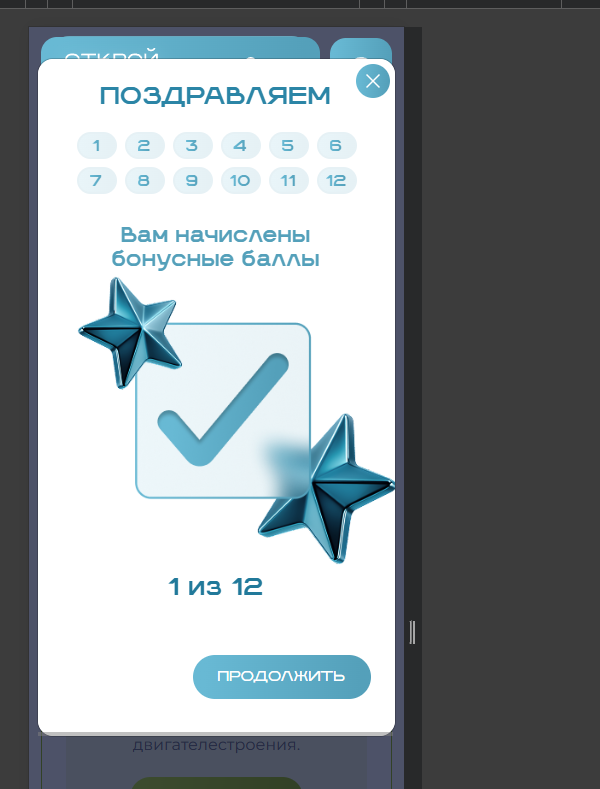

# Отчёт по вёрстке и фронтенду — Открой#Моспром (объединённый)

**Сайт:** https://otkroimosprom.ru/

---

# Корректность вёрстки на различных разрешениях экранов (375–768, 768–900, 900–1024, 1024–1200, 1200–1440, 1440–1960+)

Проверены: главная, о нас, проекты, новости, навигатор, контакты, регистрация, правила, cookies, пространство, политика, **все 8 карточек предприятий** (`/enterprise/*`), ЛК (профиль, записи, лояльность, квизы, конкурс). Пройдены диапазоны **375–768** (375, 414, 480, 600, 650, 700, 767, 768), **768–900** (800, 850, 900), **900–1024** (950, 992, 1000), **1024–1200** (1100, 1152, 1200), **1200–1440** (1240, 1280, 1366, 1440), **1440–1960+** (1600, 1920, 1960).

---

## Ширины 375–767px

### На 576–767px контент всех страниц в узкой колонке ~576px, по бокам пустота

С ширины **576px** контейнер `.container` фиксируется на `max-width: 576px` и центрируется. На 650–767 по бокам остаются поля ~40–95px: страница выглядит как узкая колонка в середине окна. На 375–575 контейнер тянется почти на всю ширину — баг проявляется именно в «планшетной» зоне до 768.

**Где:** `/`, `/about/`, `/projects/`, `/news/`, `/contacts/`, `/rules/`, `/personal/`, `/personal/loyalty/`, `/personal/space/`, `/personal/quiz/` и др.  
**повторяется в:** Google Chrome, Safari, Яндекс.Браузер, Mozilla Firefox, Opera, Microsoft Edge

---

### На 576–767px синяя плашка шапки не на всю ширину экрана

`.header_flex` внутри контейнера + `margin-right: 72px` под иконку «глаза» → синяя «капсула» шапки ~480px при viewport 650–767. Справа и слева от плашки пустое поле; иконка доступности торчит сбоку от синего фона.

**Где:** почти все страницы.  
**повторяется в:** Google Chrome, Safari, Яндекс.Браузер, Mozilla Firefox, Opera, Microsoft Edge

---

### На 576–767px выпадающее бургер-меню тоже узкое (~480px), не на весь экран

Меню открывается на ширину синей плашки шапки, по бокам пустые зоны; пункты «О нас / Проекты / …» не на всю ширину окна.

**Где:** шапка на всех страницах.  
**повторяется в:** Google Chrome, Safari, Яндекс.Браузер, Mozilla Firefox, Opera, Microsoft Edge

---

### На 375–767px зона нажатия бургера слишком маленькая (~25×24)

Иконка меню меньше комфортной touch-области; рядом профиль — легко промахнуться.

**Где:** мобильная шапка.  
**повторяется в:** Google Chrome, Safari, Яндекс.Браузер, Mozilla Firefox, Opera, Microsoft Edge

---

### На границе 767 → 768 резкий скачок вёрстки

До 767 включительно — мобильные стили (`max-width: 767px`) и контейнер 576px. С 768 включается другой набор (`min-width: 768px`): ширина контейнера и шапки меняются скачком. На реальных устройствах с шириной ~768 (iPad mini и т.п.) вёрстка «прыгает».

**Где:** все страницы.  
**повторяется в:** Google Chrome, Safari, Яндекс.Браузер, Mozilla Firefox, Opera, Microsoft Edge

---

### На 375–767px левое меню ЛК скрыто — навигация только через иконки шапки

Сайдбар `.sidebar` / `.mobile_profile` с нулевыми размерами; разделы кабинета недоступны как привычное боковое меню.

**Где:** `/personal/*`  
**повторяется в:** Google Chrome, Safari, Яндекс.Браузер, Mozilla Firefox, Opera, Microsoft Edge

---

### На 600–767px вкладки лояльности («Мой баланс» / «История» / «Заказы») в узкой рамке съезжают

Три вкладки в ряд внутри контейнера 576px; активная вкладка и зелёная рамка блока визуально не совпадают по краям.

**Где:** `/personal/loyalty/`  
**повторяется в:** Google Chrome, Safari, Яндекс.Браузер, Mozilla Firefox, Opera, Microsoft Edge

---

### На 375–650px в форме конкурса дата рождения — нативный `type=date` (формат mm/dd/yyyy)

Поле «Дата рождения ребенка» рисуется браузерным datepicker с маской mm/dd/yyyy вместо ожидаемого дд.мм.гггг; на узкой ширине контрол выглядит чужеродно относительно остальных полей формы.

**Где:** `/personal/space/`  
**повторяется в:** Google Chrome, Safari, Яндекс.Браузер, Mozilla Firefox, Opera, Microsoft Edge

---

### На 375–767px в форме конкурса подписи полей отображаются под инпутами

Подписи «Фамилия и имя ребенка*», «Дата рождения ребенка*» и др. стоят ниже полей ввода, а не над ними — ломает привычный паттерн формы и читаемость на мобиле.

**Где:** `/personal/space/`  
**повторяется в:** Google Chrome, Safari, Яндекс.Браузер, Mozilla Firefox, Opera, Microsoft Edge

---

### На 375px декоративные шестерёнки карточек проектов обрезаются краем

`.project_gear1` / `.project_gear2` / `.project_gear3` выходят за границы карточки и viewport (частично обрезаны).

**Где:** `/projects/`  
**повторяется в:** Google Chrome, Safari, Яндекс.Браузер, Mozilla Firefox, Opera, Microsoft Edge

---

## Ширина 768px

### На 768px контент сжимается в узкую колонку / скачет относительно 767

На части сценариев у края 768 сохраняется ощущение «колонки + пустота» и/или резкий переход от режима 576px-контейнера (см. блок 375–767).

**Где:** `/`, `/personal/`, `/personal/loyalty/`, `/personal/quiz/`, `/projects/` и др.  
**повторяется в:** Google Chrome, Safari, Яндекс.Браузер, Mozilla Firefox, Opera, Microsoft Edge

---

### На 768px шапка не на всю ширину окна

Мобильная/переходная шапка визуально уже окна — синяя плашка и иконки не заполняют ширину viewport.

**Где:** почти все страницы.  
**повторяется в:** Google Chrome, Safari, Яндекс.Браузер, Mozilla Firefox, Opera, Microsoft Edge

---

### На 768px левое меню ЛК пропадает — ломает навигацию кабинета

Сайдбар не виден; остаются только иконки в шапке.

**Где:** `/personal/*`  
**повторяется в:** Google Chrome, Safari, Яндекс.Браузер, Mozilla Firefox, Opera, Microsoft Edge

---

### На 768px карточки слайдера предприятий выезжают за край экрана

Заголовки и «Узнать подробнее» уходят за правую границу.

**Где:** `/`  
**повторяется в:** Google Chrome, Safari, Яндекс.Браузер, Mozilla Firefox, Opera, Microsoft Edge

---

### На 768px неровная сетка карточек на «Проекты»

В одном ряду разная высота карточек.

**Где:** `/projects/`  
**повторяется в:** Google Chrome, Safari, Яндекс.Браузер, Mozilla Firefox, Opera, Microsoft Edge

---

### На 768px в лояльности текст не помещается в плашки баллов

Подписи впритык к краям, ломают карточку баланса.

**Где:** `/personal/loyalty/`  
**повторяется в:** Google Chrome, Safari, Яндекс.Браузер, Mozilla Firefox, Opera, Microsoft Edge

---

### На 768px вкладка «Мой баланс» смещена относительно рамки контента

Активная вкладка не совпадает с границей контейнера.

**Где:** `/personal/loyalty/`  
**повторяется в:** Google Chrome, Safari, Яндекс.Браузер, Mozilla Firefox, Opera, Microsoft Edge

---

### На 768px иконки в мобильной шапке стоят слишком плотно

Мало воздуха между профилем, бургером и соседними элементами.

**повторяется в:** Google Chrome, Safari, Яндекс.Браузер, Mozilla Firefox, Opera, Microsoft Edge

---

## Ширины 768–900px

### На 768–900px прилипшая шапка `.header_fixed` застревает ~379px при ширине окна 800–900

У fixed-шапки фактически `right` оставляет справа ~400–450px пустоты: при скролле синяя «капсула» и иконки остаются узкой полоской слева, контент уже шире шапки. Контейнер контента при этом ~744–768px.

**Где:** все страницы (особенно заметно в ЛК и на главной).  
**повторяется в:** Google Chrome, Safari, Яндекс.Браузер, Mozilla Firefox, Opera, Microsoft Edge

---

### На 768–900px остаётся мобильная шапка (бургер), десктопное меню скрыто

Пункты «О нас / Проекты / …» и кнопка «ПРОФИЛЬ» в шапке не видны (`width: 0`); навигация только через бургер ~25×24. Контент уже «планшетный», chrome — мобильный.

**Где:** шапка на всех страницах.  
**повторяется в:** Google Chrome, Safari, Яндекс.Браузер, Mozilla Firefox, Opera, Microsoft Edge

---

### На 768–900px левое меню ЛК по-прежнему скрыто (0×0)

Сайдбар не появляется после 768: разделы кабинета недоступны как боковое меню до перехода на более широкие брейкпоинты (~1100+).

**Где:** `/personal/*`  
**повторяется в:** Google Chrome, Safari, Яндекс.Браузер, Mozilla Firefox, Opera, Microsoft Edge

---

### На ~850–900px в профиле «Редактировать» наезжает на строку Email

Кнопка перекрывает текст email; подпись контакта читается сквозь/из-под кнопки.

**Где:** `/personal/`  
**повторяется в:** Google Chrome, Safari, Яндекс.Браузер, Mozilla Firefox, Opera, Microsoft Edge

---

### На ~900px в навигаторе кнопка «Создать экскурсию» оторвана от сетки

Кнопка «висит» справа между вкладками («Все программы / Ближайшие / Онлайн») и строкой поиска, не выровнена ни с одним рядом.

**Где:** `/events/`  
**повторяется в:** Google Chrome, Safari, Яндекс.Браузер, Mozilla Firefox, Opera, Microsoft Edge

---

## Ширины 900–1024px

### На 900–1024px `.header_fixed` всё ещё ~379px — шапка не догоняет ширину окна

Та же поломка fixed-шапки, что на 768–900: при viewport 900–992 синяя плашка ~379px, справа большое пустое поле.

**Где:** все страницы.  
**повторяется в:** Google Chrome, Safari, Яндекс.Браузер, Mozilla Firefox, Opera, Microsoft Edge

---

### На ~992px кнопки «Редактировать» / «Настройки» съезжают влево, текст обрезается

Кнопки прижаты к левому краю карточки профиля, «Редактиров…» клипится; визуально ломают блок с аватаром и данными.

**Где:** `/personal/`  
**повторяется в:** Google Chrome, Safari, Яндекс.Браузер, Mozilla Firefox, Opera, Microsoft Edge

---

### На ~992px в футере ссылки в узких колонках ломаются; «Мы в МАКС» клипится

Колонки футера слишком узкие (`Статьи и лекции` ~74px и т.п.), текст переносится криво; у «Мы в МАКС» `scrollWidth > clientWidth`.

**Где:** футер на страницах ЛК и публичных.  
**повторяется в:** Google Chrome, Safari, Яндекс.Браузер, Mozilla Firefox, Opera, Microsoft Edge

---

### На 900–1024px сайдбар ЛК всё ещё отсутствует

До появления полноценной десктопной шапки (~1100) боковое меню ЛК не отображается.

**Где:** `/personal/*`  
**повторяется в:** Google Chrome, Safari, Яндекс.Браузер, Mozilla Firefox, Opera, Microsoft Edge

---

## Ширина 1024px

### На 1024px страница ломается горизонтальным скроллом

scrollWidth больше окна (например ~1152–1153 > 1024).

**Где:** `/about/`, `/space/`, `/policy/`, `/personal/`, также другие страницы с широкой шапкой.  
**повторяется в:** Google Chrome, Safari, Яндекс.Браузер, Mozilla Firefox, Opera, Microsoft Edge

---

### На 1024px кнопка «ПРОФИЛЬ» / «ВОЙТИ» выезжает за край / обрезается

Видно «ПРОФИ…» / «ВОЙТ…» — элемент не помещается в шапку.

**Где:** шапка на всех страницах (в т.ч. `/about/`, `/space/`).  
**повторяется в:** Google Chrome, Safari, Яндекс.Браузер, Mozilla Firefox, Opera, Microsoft Edge

---

### На 1024px шапка уже окна

`.header_fixed` меньше viewport (~992 при 1024) — зазор, «прыжки» при скролле.

**Где:** все страницы.  
**повторяется в:** Google Chrome, Safari, Яндекс.Браузер, Mozilla Firefox, Opera, Microsoft Edge

---

### На 1024px на `/about/` блок статистики впритык к правому краю, контент визуально обрезается

Сетка «7 ЛЕТ / >3500 экскурсий / >100 мастер-классов / >140 предприятий» уезжает вправо без нормального поля: правые карточки flush к краю viewport, вместе с обрезанной «ВОЙТИ»/«ПРОФИЛЬ» страница выглядит «срезанной». Горизонтальный скролл ~1152 > 1024.

**Где:** `/about/`  
**повторяется в:** Google Chrome, Safari, Яндекс.Браузер, Mozilla Firefox, Opera, Microsoft Edge

---

### На 1024px кнопки «Редактировать» и «Настройки» не помещаются и выезжают за границы карточки

Текст обрезан, кнопки наезжают друг на друга и на карточку профиля.

**Где:** `/personal/`  
**повторяется в:** Google Chrome, Safari, Яндекс.Браузер, Mozilla Firefox, Opera, Microsoft Edge

---

### На 1024px контент ЛК обрезается справа, страница визуально «разрезана»

Правая часть уходит за край — ломает страницу.

**Где:** `/personal/`  
**повторяется в:** Google Chrome, Safari, Яндекс.Браузер, Mozilla Firefox, Opera, Microsoft Edge

---

### На 1024px на главной огромная пустая зона — вёрстка разъезжается

Блоки смещаются, лишняя пустота по центру/сбоку.

**Где:** `/`  
**повторяется в:** Google Chrome, Safari, Яндекс.Браузер, Mozilla Firefox, Opera, Microsoft Edge

---

### На 1024px текст не помещается в кнопки («СМОТРЕТЬ ВСЕ» и др.)

Перенос/наезд на рамку; иногда кнопка «висит в пустоте».

**Где:** `/`  
**повторяется в:** Google Chrome, Safari, Яндекс.Браузер, Mozilla Firefox, Opera, Microsoft Edge

---

### На 1024px на `/space/` заголовки карточек призов обрезаются краем («ЭКСКУРСИ…», «СЛЕД В КОСМОСЕ»)

В блоке «Призы космического масштаба» три карточки в ряд: у `.project_title` ширина контейнера ~243px при `font-size: 36px`, `scrollWidth > clientWidth` — «ЭКСКУРСИЮ» / «ЭКСКУРСИИ» обрубается последней буквой, «СЛЕД В КОСМОСЕ» тоже клипится. «ПОДАРКИ» ещё влезает.

**Где:** `/space/`  
**повторяется в:** Google Chrome, Safari, Яндекс.Браузер, Mozilla Firefox, Opera, Microsoft Edge

---

### На 1024px на `/space/` у шагов конкурса тоже клипятся заголовки

В блоке «Всего четыре шага…» обрезаются «РЕГИСТРАЦИЯ», «ГОЛОСОВАНИЕ», «НАГРАЖДЕНИЕ» (`scrollWidth` ~226–231 при `clientWidth` ~172).

**Где:** `/space/`  
**повторяется в:** Google Chrome, Safari, Яндекс.Браузер, Mozilla Firefox, Opera, Microsoft Edge

---

### На 1024px на `/space/` горизонтальный скролл (~1152 > 1024)

Страница шире окна; вместе с обрезкой «ПРОФИЛЬ»/«ВОЙТИ» в шапке.

**Где:** `/space/`  
**повторяется в:** Google Chrome, Safari, Яндекс.Браузер, Mozilla Firefox, Opera, Microsoft Edge

---

### На 1024px на `/policy/` текст политики обрезается у правого края

Абзацы выходят за padding `.container` (992px); слова вроде «Сайта.» / «Федерации.» визуально срезаны краем viewport.

**Где:** `/policy/`  
**повторяется в:** Google Chrome, Safari, Яндекс.Браузер, Mozilla Firefox, Opera, Microsoft Edge

---

## Ширины 1024–1200px

### На ~1100px горизонтальный скролл страницы (~1190 > 1100)

`document`/`body` scrollWidth больше viewport на публичных страницах и в ЛК — появляется горизонтальная полоса прокрутки.

**Где:** `/news/`, `/personal/loyalty/`, также другие страницы с широкой шапкой.  
**повторяется в:** Google Chrome, Safari, Яндекс.Браузер, Mozilla Firefox, Opera, Microsoft Edge

---

### На ~1100px `.header_fixed` ~992px при окне 1100 — шапка уже окна

Прилипшая шапка не на всю ширину; при скролле справа остаётся зазор.

**Где:** все страницы.  
**повторяется в:** Google Chrome, Safari, Яндекс.Браузер, Mozilla Firefox, Opera, Microsoft Edge

---

### На ~1100px кнопка «ПРОФИЛЬ» впритык к правому краю / визуально подрезается

Правый край зелёной кнопки упирается в край окна/контейнера.

**Где:** шапка (ЛК, новости, лояльность и др.).  
**повторяется в:** Google Chrome, Safari, Яндекс.Браузер, Mozilla Firefox, Opera, Microsoft Edge

---

### На ~1100–1200px в каталоге мерча «Термокружка» ломается переносом («Термокружк» + «а»)

Одиночная буква «а» уходит на следующую строку из‑за некорректного `word-break` / узкой колонки карточки.

**Где:** `/personal/loyalty/` (каталог мерча).  
**повторяется в:** Google Chrome, Safari, Яндекс.Браузер, Mozilla Firefox, Opera, Microsoft Edge

---

### На ~1100px в новостях в одном ряду текст и фото разной высоты

Текстовая карточка заметно выше соседней с изображением — низ ряда «зубчатый», сетка неровная.

**Где:** `/news/`  
**повторяется в:** Google Chrome, Safari, Яндекс.Браузер, Mozilla Firefox, Opera, Microsoft Edge

---

### На ~1200px «Редактировать» наезжает на аватар в карточке профиля

Синяя кнопка перекрывает нижнюю часть круга с фото; «Настройки» с малым внутренним padding, текст впритык к краям кнопки.

**Где:** `/personal/`  
**повторяется в:** Google Chrome, Safari, Яндекс.Браузер, Mozilla Firefox, Opera, Microsoft Edge

---

## Ширина 1240px

### На 1240px кнопки профиля наслаиваются и выезжают за границы блока

«Редактировать» / «Настройки» перекрывают друг друга, текст обрезан.

**Где:** `/personal/`  
**повторяется в:** Google Chrome, Safari, Яндекс.Браузер, Mozilla Firefox, Opera, Microsoft Edge

---

### На 1240px блок ЛК прижат влево, справа широкая пустота

Внутренний скролл контейнера — вёрстка «едет».

**Где:** `/personal/`, `/personal/quiz/`, `/personal/loyalty/`  
**повторяется в:** Google Chrome, Safari, Яндекс.Браузер, Mozilla Firefox, Opera, Microsoft Edge

---

### На 1240px шапка и контент не выровнены по ширине окна

Ощущение «сайта в половине экрана».

**Где:** ЛК и часть публичных страниц.  
**повторяется в:** Google Chrome, Safari, Яндекс.Браузер, Mozilla Firefox, Opera, Microsoft Edge

---

### На 1240px неровная сетка карточек (проекты / новости / навигатор)

Разная высота в одном ряду, «Подробнее» не на одной линии.

**Где:** `/projects/`, `/news/`, `/events/`  
**повторяется в:** Google Chrome, Safari, Яндекс.Браузер, Mozilla Firefox, Opera, Microsoft Edge

---

## Ширины 1200–1440px

### На ~1366px на контактах лёгкий горизонтальный скролл (~1392 > 1366)

Страница чуть шире окна — появляется горизонтальная прокрутка.

**Где:** `/contacts/` (и часть страниц с широкой шапкой/декором).  
**повторяется в:** Google Chrome, Safari, Яндекс.Браузер, Mozilla Firefox, Opera, Microsoft Edge

---

### На 1200–1440px элементы шапки (лого / меню / «ПРОФИЛЬ») не на одной вертикальной линии

Кнопка «ПРОФИЛЬ» визуально выше/ниже центрального меню; зазоры между логотипом, nav-капсулой и профилем неравномерные.

**Где:** шапка на десктопе.  
**повторяется в:** Google Chrome, Safari, Яндекс.Браузер, Mozilla Firefox, Opera, Microsoft Edge

---

## Ширина 1960px (широкий монитор)

### На 1960px шапка не на всю ширину — зазор справа

`.header_fixed` ~1380px при широком окне; при скролле «прыгает».

**Где:** все страницы.  
**повторяется в:** Google Chrome, Safari, Яндекс.Браузер, Mozilla Firefox, Opera, Microsoft Edge

---

### На 1960px контент и шапка не растягиваются

Большие поля по бокам; на части страниц возможен горизонтальный скролл из‑за несовпадения ширин.

**Где:** `/`, `/news/`, `/personal/*` и др.  
**повторяется в:** Google Chrome, Safari, Яндекс.Браузер, Mozilla Firefox, Opera, Microsoft Edge

---

### На широких экранах слайдер/карточки выезжают за границы родителя

Элементы slick выходят за `slick-list`.

**Где:** `/`  
**повторяется в:** Google Chrome, Safari, Яндекс.Браузер, Mozilla Firefox, Opera, Microsoft Edge

---

## Ширины 1440–1960+

### На ~1600px горизонтальный скролл главной (~1678 > 1600)

`scrollWidth` документа больше окна; страница «плывёт» вбок при широком мониторе.

**Где:** `/` (и связанные блоки со слайдером/декором).  
**повторяется в:** Google Chrome, Safari, Яндекс.Браузер, Mozilla Firefox, Opera, Microsoft Edge

---

### На 1440–1600+ `.header_fixed` заметно уже окна (~1384 при 1600)

Прилипшая шапка не растягивается на всю ширину viewport — справа зазор, при скролле «прыжок» относительно контента.

**Где:** все страницы.  
**повторяется в:** Google Chrome, Safari, Яндекс.Браузер, Mozilla Firefox, Opera, Microsoft Edge

---

# Ошибки адаптивной вёрстки (смещения, наложения, отступы, масштабирование)

## Шапка не помещается по ширине на части разрешений

Элементы сжимаются, обрезаются или уезжают.

**повторяется в:** Google Chrome, Safari, Яндекс.Браузер, Mozilla Firefox, Opera, Microsoft Edge

---

## Шапка уезжает влево при скролле наверх

Меню и кнопки съезжают относительно контента, справа пустота.

**повторяется в:** Google Chrome, Safari, Яндекс.Браузер, Mozilla Firefox, Opera, Microsoft Edge

---

## «Призрак» двойной шапки

Второй ряд логотипа/меню поверх.

**повторяется в:** Google Chrome, Safari, Яндекс.Браузер, Mozilla Firefox, Opera, Microsoft Edge

---

## На заголовок «Проекты» наезжает контент снизу

Графика/карточка перекрывает буквы.

**Где:** `/projects/`  
**повторяется в:** Google Chrome, Safari, Яндекс.Браузер, Mozilla Firefox, Opera, Microsoft Edge

---

## На `/space/` заголовки карточек призов и шагов обрезаются на ~1024px

«ЭКСКУРСИЮ» / «СЛЕД В КОСМОСЕ», а также «РЕГИСТРАЦИЯ» / «ГОЛОСОВАНИЕ» / «НАГРАЖДЕНИЕ» — текст не помещается в `.project_title`, последняя буква срезана.

**Где:** `/space/`  
**повторяется в:** Google Chrome, Safari, Яндекс.Браузер, Mozilla Firefox, Opera, Microsoft Edge

---

## Стрелки слайдера наезжают на заголовок «Что посмотреть в этом месяце»

**Где:** `/`  
**повторяется в:** Google Chrome, Safari, Яндекс.Браузер, Mozilla Firefox, Opera, Microsoft Edge

---

## Некорректные отступы на адаптиве

Где‑то огромные промежутки, где‑то контент впритык к краю.

**повторяется в:** Google Chrome, Safari, Яндекс.Браузер, Mozilla Firefox, Opera, Microsoft Edge

---

## Масштабирование: текст на адаптиве слишком крупный

Много лишнего скролла на мобиле/планшете.

**повторяется в:** Google Chrome, Safari, Яндекс.Браузер, Mozilla Firefox, Opera, Microsoft Edge

---

## Горизонтальный скролл около 375px

В режиме отзывчивого устройства Chrome; на реальном устройстве с теми же параметрами может быть нормально (из таблицы).

**повторяется в:** Google Chrome, Safari, Яндекс.Браузер, Mozilla Firefox, Opera, Microsoft Edge

---

## Левое меню ЛК ломается на промежуточных разрешениях

Наезды на шапку/контент, съезд пунктов, кривая полоска активного пункта.

**Где:** `/personal/*`  
**повторяется в:** Google Chrome, Safari, Яндекс.Браузер, Mozilla Firefox, Opera, Microsoft Edge

---

## Таблицы на /cookies выезжают за границы на узких ширинах

Текст слипается; на мобиле таблицы не влезают.

**Где:** `/cookies`  
**повторяется в:** Google Chrome, Safari, Яндекс.Браузер, Mozilla Firefox, Opera, Microsoft Edge

---

## На `/policy/` текст уезжает за контейнер на ~992–1024px

Длинные абзацы политики (п. 4–5, «Обратная связь» и др.) выходят за content-box `.container` (max-width 992px, padding 12px, `overflow: visible`, шрифт ~20px): строки заходят в padding и обрезаются у края окна. На 1024 дополнительно горизонтальный скролл (~1152) и обрезка «ПРОФИЛЬ»/«ВОЙТИ».

**Где:** `/policy/`  
**повторяется в:** Google Chrome, Safari, Яндекс.Браузер, Mozilla Firefox, Opera, Microsoft Edge

---

## Кривые списки на /rules

Маркеры как отдельные символы, неровные отступы.

**Где:** `/rules/`  
**повторяется в:** Google Chrome, Safari, Яндекс.Браузер, Mozilla Firefox, Opera, Microsoft Edge

---

## Длинные числа и бейджи ломают «таблетки» / плашки

Баллы, цены упираются в края блоков.

**Где:** ЛК, лояльность, квизы.  
**повторяется в:** Google Chrome, Safari, Яндекс.Браузер, Mozilla Firefox, Opera, Microsoft Edge

---

## Карточки навигатора / проектов / календаря разной высоты

Неровная сетка, кнопки в ряду не выровнены.

**Где:** `/events/`, `/projects/`  
**повторяется в:** Google Chrome, Safari, Яндекс.Браузер, Mozilla Firefox, Opera, Microsoft Edge

---

## Длинные названия карточек в навигаторе ломают вёрстку на узком экране

Неаккуратные переносы, переполнение.

**Где:** `/events/`  
**повторяется в:** Google Chrome, Safari, Яндекс.Браузер, Mozilla Firefox, Opera, Microsoft Edge

---

## Форма регистрации на мобиле прилипает к краю

Мало боковых отступов, подписи переносятся криво.

**Где:** `/registration/`  
**повторяется в:** Google Chrome, Safari, Яндекс.Браузер, Mozilla Firefox, Opera, Microsoft Edge

---

## Форма контактов на части ширин прижата или с лишней пустотой

**Где:** `/contacts/`  
**повторяется в:** Google Chrome, Safari, Яндекс.Браузер, Mozilla Firefox, Opera, Microsoft Edge

---

## В форме конкурса подписи полей стоят под инпутами, а не над ними

Label оказывается ниже поля (`top` подписи = `bottom` инпута): «Фамилия и имя ребенка*», «Дата рождения ребенка*», «ФИО законного представителя*», «Контактный телефон*» и др. Выглядит как сломанный float/order, а не осознанный UX.

**Где:** `/personal/space/`  
**повторяется в:** Google Chrome, Safari, Яндекс.Браузер, Mozilla Firefox, Opera, Microsoft Edge

---

## В модалке «Войти» на узкой ширине низ формы обрезается / прилипает к краю

Ссылка «Зарегистрируйтесь» у самого низа оверлея; при небольшой высоте viewport модалка не умещается целиком без скролла.

**Где:** попап авторизации (`#auth`).  
**повторяется в:** Google Chrome, Safari, Яндекс.Браузер, Mozilla Firefox, Opera, Microsoft Edge

---

# Интерактивные элементы (кнопки, формы, выпадающие списки)

## Не на всех кнопках есть hover

**повторяется в:** Google Chrome, Safari, Яндекс.Браузер, Mozilla Firefox, Opera, Microsoft Edge

---

## Не на всех ссылках есть hover

**повторяется в:** Google Chrome, Safari, Яндекс.Браузер, Mozilla Firefox, Opera, Microsoft Edge

---

## Клик по лупе поиска может не запускать поиск

Кнопка — `type="button"`; без скрипта поиск не уходит.

**повторяется в:** Google Chrome, Safari, Яндекс.Браузер, Mozilla Firefox, Opera, Microsoft Edge

---

## Поиск/фильтры на мобиле отображаются криво

Текст обрезается, элементы наезжают.

**повторяется в:** Google Chrome, Safari, Яндекс.Браузер, Mozilla Firefox, Opera, Microsoft Edge

---

## Фильтры на главной и в навигаторе на узком экране съедают экран

«Возраст / Формат / Направление»; низ перекрывается cookie.

**повторяется в:** Google Chrome, Safari, Яндекс.Браузер, Mozilla Firefox, Opera, Microsoft Edge

---

## Меню сайта и меню ЛК открываются вместе и наслаиваются

Второе не закрывает первое.

**повторяется в:** Google Chrome, Safari, Яндекс.Браузер, Mozilla Firefox, Opera, Microsoft Edge

---

## Оверлей меню не перекрывает шапку и «глаз»

**повторяется в:** Google Chrome, Safari, Яндекс.Браузер, Mozilla Firefox, Opera, Microsoft Edge

---

## Регистрация: почти нет проверки обязательных полей на экране

Можно отправить пустые поля; форма уходит, открывается ЛК (из таблицы).

**Где:** `/registration/`, попап регистрации.  
**повторяется в:** Google Chrome, Safari, Яндекс.Браузер, Mozilla Firefox, Opera, Microsoft Edge

---

## Регистрация: поле «Имя» принимает любые символы, включая спецсимволы

**повторяется в:** Google Chrome, Safari, Яндекс.Браузер, Mozilla Firefox, Opera, Microsoft Edge

---

## Регистрация: телефон проверяет только количество цифр (10)

**повторяется в:** Google Chrome, Safari, Яндекс.Браузер, Mozilla Firefox, Opera, Microsoft Edge

---

## Регистрация: email — только @ и частично кириллица; домен не проверяется

После такой регистрации вход может дать «Доступ запрещен» (из таблицы).

**повторяется в:** Google Chrome, Safari, Яндекс.Браузер, Mozilla Firefox, Opera, Microsoft Edge

---

## Регистрация: пароль без сложности, проверки только после «Зарегистрироваться»

Только длина ≥ 6; совпадение паролей — после отправки.

**повторяется в:** Google Chrome, Safari, Яндекс.Браузер, Mozilla Firefox, Opera, Microsoft Edge

---

## На странице регистрации нет галочек согласия (во всплывающей — есть)

Два разных интерфейса регистрации.

**повторяется в:** Google Chrome, Safari, Яндекс.Браузер, Mozilla Firefox, Opera, Microsoft Edge

---

## Во всплывающей регистрации валидация тоже слабая

Телефон с маской можно оставить недописанным.

**повторяется в:** Google Chrome, Safari, Яндекс.Браузер, Mozilla Firefox, Opera, Microsoft Edge

---

## «Забыли пароль»: на невалидный/несуществующий email всё равно уходит запрос

С валидным адресом письмо приходит и пароль меняется (из таблицы).

**повторяется в:** Google Chrome, Safari, Яндекс.Браузер, Mozilla Firefox, Opera, Microsoft Edge

---

## Запись на экскурсии: обязательные поля не отмечены

**повторяется в:** Google Chrome, Safari, Яндекс.Браузер, Mozilla Firefox, Opera, Microsoft Edge

---

## Запись: нет валидации серии/номера паспорта

Любое количество символов.

**повторяется в:** Google Chrome, Safari, Яндекс.Браузер, Mozilla Firefox, Opera, Microsoft Edge

---

## Запись на экскурсии/лекции: почти нет валидации полей

В большинстве полей любые символы; в email — `@` и отсутствие кириллицы в локальной части. «Кривая» форма успешно отправляется, есть уведомление и запись в ЛК (из таблицы).

**повторяется в:** Google Chrome, Safari, Яндекс.Браузер, Mozilla Firefox, Opera, Microsoft Edge

---

## Запись: возрастной ценз не учитывается

**повторяется в:** Google Chrome, Safari, Яндекс.Браузер, Mozilla Firefox, Opera, Microsoft Edge

---

## Конкурс (ЛК): слабая валидация и успешная отправка кривых данных

Любые символы; email — `@` без кириллицы в локальной части; телефон — цифры без проверки количества; дата рождения — любые цифры; email проверяется после «Отправить заявку»; форма с мусором уходит успешно (из таблицы).

**Где:** `/personal/space/`  
**повторяется в:** Google Chrome, Safari, Яндекс.Браузер, Mozilla Firefox, Opera, Microsoft Edge

---

## Конкурс: прикреплённый файл не отображается

Непонятно, прикрепился ли файл.

**Где:** `/personal/space/`  
**повторяется в:** Google Chrome, Safari, Яндекс.Браузер, Mozilla Firefox, Opera, Microsoft Edge

---

## Пункт «Конкурс» ведёт на /personal/space/; /personal/contest/ — сломанный URL

Прямой `/personal/contest/` открывается как «Карта сайта» / не тот контент.

**повторяется в:** Google Chrome, Safari, Яндекс.Браузер, Mozilla Firefox, Opera, Microsoft Edge

---

## Смена даты рождения в профиле не срабатывает

Javascript/datepicker не работает; остальное в профиле меняется (из таблицы).

**Где:** `/personal/`  
**повторяется в:** Google Chrome, Safari, Яндекс.Браузер, Mozilla Firefox, Opera, Microsoft Edge

---

## Пустой телефон в профиле без заглушки

Строка «Телефон:» выглядит пустой.

**Где:** `/personal/`  
**повторяется в:** Google Chrome, Safari, Яндекс.Браузер, Mozilla Firefox, Opera, Microsoft Edge

---

## Календарь проектов: нет сброса фильтров

**Где:** `/projects/`  
**повторяется в:** Google Chrome, Safari, Яндекс.Браузер, Mozilla Firefox, Opera, Microsoft Edge

---

## Календарь проектов: прошедшие мероприятия без пометки

Легко перепутать с актуальными (из таблицы).

**Где:** `/projects/`  
**повторяется в:** Google Chrome, Safari, Яндекс.Браузер, Mozilla Firefox, Opera, Microsoft Edge

---

## Счётчик квизов не совпадает с числом карточек

Например «Текущие (3)» при 2 плашках (из таблицы).

**Где:** `/personal/quiz/`  
**повторяется в:** Google Chrome, Safari, Яндекс.Браузер, Mozilla Firefox, Opera, Microsoft Edge

---

## После прохождения квиза список не обновляется сразу

Нужно уйти со вкладки и вернуться; простой refresh не помогает (из таблицы).

**Где:** `/personal/quiz/`  
**повторяется в:** Google Chrome, Safari, Яндекс.Браузер, Mozilla Firefox, Opera, Microsoft Edge

---

## В модалке квиза заголовок наезжает на крестик

**повторяется в:** Google Chrome, Safari, Яндекс.Браузер, Mozilla Firefox, Opera, Microsoft Edge

---

## Оверлей квиза не перекрывает шапку; фон остаётся кликабельным

Шапка, «Выйти», другие «Пройти квиз» доступны поверх модалки.

**повторяется в:** Google Chrome, Safari, Яндекс.Браузер, Mozilla Firefox, Opera, Microsoft Edge

---

## В модалке квиза варианты ответа плохо доступны; «Ответить» disabled с плохим контрастом

**повторяется в:** Google Chrome, Safari, Яндекс.Браузер, Mozilla Firefox, Opera, Microsoft Edge

---

## Стрелка в кнопке «Пройти квиз» не по центру

**Где:** `/personal/quiz/`  
**повторяется в:** Google Chrome, Safari, Яндекс.Браузер, Mozilla Firefox, Opera, Microsoft Edge

---

## Длинные бейджи баллов на карточке квиза могут не вмещаться

**Где:** `/personal/quiz/`  
**повторяется в:** Google Chrome, Safari, Яндекс.Браузер, Mozilla Firefox, Opera, Microsoft Edge

---

## На контактах неактивная «Отправить» без понятной подсказки

Пока не отмечены согласия — непонятно, почему нельзя нажать.

**Где:** `/contacts/`  
**повторяется в:** Google Chrome, Safari, Яндекс.Браузер, Mozilla Firefox, Opera, Microsoft Edge

---

## Раздел /enterprise/ открывает главную вместо списка предприятий

**повторяется в:** Google Chrome, Safari, Яндекс.Браузер, Mozilla Firefox, Opera, Microsoft Edge

---

## Карточки предприятий: проверены все 8 URL

`/enterprise/firma-cheremushki/`, `/enterprise/gk-moskabelmet/`, `/enterprise/gnts-rf-fgup-nami/`, `/enterprise/ao-shcherbinskiy-liftostroitelnyy-zavod-ao-shchlz-/`, `/enterprise/ao-tsito/`, `/enterprise/ooo-nyukon-enerdzhi/`, `/enterprise/mpbk-ochakovo/`, `/enterprise/muzey-npo-molniya/`.

**повторяется в:** Google Chrome, Safari, Яндекс.Браузер, Mozilla Firefox, Opera, Microsoft Edge

---

## На `/enterprise/gnts-rf-fgup-nami/` нет блока «Схема проезда», адреса и email

У остальных семи карточек есть `.map_detail`, зелёная плашка адреса и синяя «напишите на почту». У НАМИ этих блоков нет — страница обрывается на правилах/отзывах без контактов и карты.

**Где:** `/enterprise/gnts-rf-fgup-nami/`  
**повторяется в:** Google Chrome, Safari, Яндекс.Браузер, Mozilla Firefox, Opera, Microsoft Edge

---

## Длинный H1 на карточке ЩЛЗ ломается на узкой ширине (4 строки + overflow)

Заголовок «АО «Щербинский лифтостроительный завод» (АО «ЩЛЗ»)» на 375px занимает ~146px по высоте, `scrollWidth > clientWidth`.

**Где:** `/enterprise/ao-shcherbinskiy-liftostroitelnyy-zavod-ao-shchlz-/`  
**повторяется в:** Google Chrome, Safari, Яндекс.Браузер, Mozilla Firefox, Opera, Microsoft Edge

---

## Блок «Программа экскурсии» на ~1024–1200: активный шаг раздувается, соседние — только цифра; сетка «плывёт»

Активный `.program_item` ~418–508px с текстом, неактивные ~210px без видимого текста. Текст активного шага визуально упирается в соседний квадрат; на части страниц (Очаково) крайний шаг уходит за правую границу viewport и усиливает горизонтальный скролл.

**Где:** карточки `/enterprise/*` с программой (Очаково, Нюкон, Черёмушки и др.).  
**повторяется в:** Google Chrome, Safari, Яндекс.Браузер, Mozilla Firefox, Opera, Microsoft Edge

---

## «Ближайшие мероприятия» на карточке предприятия: название вылезает за карточку, бейджи съезжают

Плашка с длинным названием (`Московский пивобезалкогольный…`) выходит за правый край `.event_item`; возраст «10+» / подписи визуально торчат или обрезаются; карточки выглядят сломанными на ~1100.

**Где:** `/enterprise/mpbk-ochakovo/` (и другие с блоком ближайших мероприятий, напр. Нюкон).  
**повторяется в:** Google Chrome, Safari, Яндекс.Браузер, Mozilla Firefox, Opera, Microsoft Edge

---

## Пустой блок «Отзывы посетителей» без заглушки

Заголовок есть, карточек отзывов 0 — сразу идёт «Оставить отзыв». Пустая зона без «Пока нет отзывов».

**Где:** `/enterprise/gk-moskabelmet/`, `/enterprise/gnts-rf-fgup-nami/`, `/enterprise/ao-shcherbinskiy-liftostroitelnyy-zavod-ao-shchlz-/`, `/enterprise/ao-tsito/`, `/enterprise/ooo-nyukon-enerdzhi/`  
**повторяется в:** Google Chrome, Safari, Яндекс.Браузер, Mozilla Firefox, Opera, Microsoft Edge

---

## Правила посещения на карточках предприятий — «кривые» списки с дефисами в `
`

Те же маркеры `-` внутри параграфов, что и на `/rules/`: не списки, неровные отступы.

**Где:** все `/enterprise/*`  
**повторяется в:** Google Chrome, Safari, Яндекс.Браузер, Mozilla Firefox, Opera, Microsoft Edge

---

## Форма отзыва: «Имя» и «Телефон/Email» readonly у авторизованного

Поля предзаполнены и заблокированы — нельзя скорректировать данные именно для отзыва; «Отправить» disabled, пока не отмечены согласия (без явной подсказки — как на контактах).

**Где:** блок «Оставить отзыв» на `/enterprise/*`  
**повторяется в:** Google Chrome, Safari, Яндекс.Браузер, Mozilla Firefox, Opera, Microsoft Edge

---

## Hero-фото на карточке предприятия вылезает за край блока / не совпадает со скруглением

Изображение справа упирается/выходит за правую границу карточки (`img.right > card.right`); острые углы фото ломают визуал скруглённой плашки.

**Где:** `/enterprise/*` (Нюкон, Очаково, Черёмушки и др.).  
**повторяется в:** Google Chrome, Safari, Яндекс.Браузер, Mozilla Firefox, Opera, Microsoft Edge

---

## На ~1100px страницы `/enterprise/*` дают горизонтальный скролл (~1190 > 1100)

Та же проблема, что у новостей/ЛК: документ шире окна.

**Где:** карточки предприятий.  
**повторяется в:** Google Chrome, Safari, Яндекс.Браузер, Mozilla Firefox, Opera, Microsoft Edge

---

## В навигаторе сначала статьи, не экскурсии; кнопка «Создать экскурсию» путает

**Где:** `/events/`  
**повторяется в:** Google Chrome, Safari, Яндекс.Браузер, Mozilla Firefox, Opera, Microsoft Edge

---

## Пустое «Нет записей» без следующего шага

**Где:** `/personal/history/`  
**повторяется в:** Google Chrome, Safari, Яндекс.Браузер, Mozilla Firefox, Opera, Microsoft Edge

---

# Удобство на мобильных устройствах (mobile UX)

## Иконка «глаза» мелкая / пропадает на промежуточных ширинах / на мобиле оторвана от шапки

**повторяется в:** Google Chrome, Safari, Яндекс.Браузер, Mozilla Firefox, Opera, Microsoft Edge

---

## Баннер cookie перекрывает низ экрана и мешает действиям

**повторяется в:** Google Chrome, Safari, Яндекс.Браузер, Mozilla Firefox, Opera, Microsoft Edge

---

## Блок конкурса на главной на телефоне слишком сжатый

Мелкий текст на «Принять участие!», мало воздуха.

**повторяется в:** Google Chrome, Safari, Яндекс.Браузер, Mozilla Firefox, Opera, Microsoft Edge

---

## На телефоне непонятно, как переключать разделы ЛК

Из‑за пропавшего меню.

**повторяется в:** Google Chrome, Safari, Яндекс.Браузер, Mozilla Firefox, Opera, Microsoft Edge

---

## Плохой контраст белого текста на зелёных кнопках

«Войти» / «Профиль» / часть CTA.

**повторяется в:** Google Chrome, Safari, Яндекс.Браузер, Mozilla Firefox, Opera, Microsoft Edge

---

## Длинный список фильтров навигатора неудобен на телефоне

Много скролла.

**Где:** `/events/`  
**повторяется в:** Google Chrome, Safari, Яндекс.Браузер, Mozilla Firefox, Opera, Microsoft Edge

---

## Текст на кнопке «Обменять» впритык к краям

**Где:** `/personal/loyalty/`  
**повторяется в:** Google Chrome, Safari, Яндекс.Браузер, Mozilla Firefox, Opera, Microsoft Edge

---

## Две цены на карточке мерча наезжают на узком экране

**Где:** `/personal/loyalty/`  
**повторяется в:** Google Chrome, Safari, Яндекс.Браузер, Mozilla Firefox, Opera, Microsoft Edge

---

## Названия мерча ломаются mid-word («Термокружк» / «а»)

Некорректный перенос длинных названий в сетке каталога на ширинах ~1100–1200.

**Где:** `/personal/loyalty/`  
**повторяется в:** Google Chrome, Safari, Яндекс.Браузер, Mozilla Firefox, Opera, Microsoft Edge

---

# Мультимедиа (загрузка и отображение)

## У многих картинок нет alt

**Где:** особенно главная и карточки.  
**повторяется в:** Google Chrome, Safari, Яндекс.Браузер, Mozilla Firefox, Opera, Microsoft Edge

---

## На новостях фото ниже текстового блока — дыра под картинкой

**Где:** `/news/`  
**повторяется в:** Google Chrome, Safari, Яндекс.Браузер, Mozilla Firefox, Opera, Microsoft Edge

---

## На новостях много пустого пространства между текстом и фото

На планшете/мобиле.

**Где:** `/news/`  
**повторяется в:** Google Chrome, Safari, Яндекс.Браузер, Mozilla Firefox, Opera, Microsoft Edge

---

## В каталоге мерча изображение / цены / кнопка съезжают внутри карточки

**Где:** `/personal/loyalty/`  
**повторяется в:** Google Chrome, Safari, Яндекс.Браузер, Mozilla Firefox, Opera, Microsoft Edge

---

## На экране результата квиза индикаторы 1–9 без прогресса и с низким контрастом

Кнопка «ПРОДОЛЖИТЬ» смещена вправо относительно центрированного контента.

**повторяется в:** Google Chrome, Safari, Яндекс.Браузер, Mozilla Firefox, Opera, Microsoft Edge

---

## Модалка квиза наезжает на заголовок «Личный кабинет»

Грязное наложение с фоном страницы.

**повторяется в:** Google Chrome, Safari, Яндекс.Браузер, Mozilla Firefox, Opera, Microsoft Edge

---

# Десктопные устройства (Windows, macOS)

На Windows и macOS (macOS — через эмулятор) — те же проблемы **1024 / 1100–1200 / 1240 / 1366 / 1600 / 1960**: обрезка «ПРОФИЛЬ», горизонтальный скролл, шапка не на всю ширину, ломаный ЛК, неровные сетки, mid-word переносы в мерче.

**повторяется в:** Google Chrome, Safari, Яндекс.Браузер, Mozilla Firefox, Opera, Microsoft Edge

---

# Мобильные устройства (iOS, Android)

На **реальных** iOS/Android — те же баги 375–767 и mobile UX: узкая колонка с 576px, короткая шапка, мелкий бургер, пропажа меню ЛК, наслоение меню, cookie, сжатый конкурс, кривой поиск/фильтры, подписи полей конкурса под инпутами, обрезка модалки входа.

**повторяется в:** Google Chrome, Safari, Яндекс.Браузер, Mozilla Firefox, Opera, Microsoft Edge

---

# Планшеты

На **~576–767** контент и шапка в узкой колонке (~576 / ~480) с пустыми полями по бокам; на **~768–1024** вёрстка ломается сильнее всего: горизонтальный скролл, обрезанная шапка/кнопки, ЛК без меню или с выездом кнопок за карточку, неровные сетки. Дополнительно на **768–900** fixed-шапка застревает ~379px при более широком контенте, остаётся бургер вместо десктоп-меню; на **900–1100** сайдбар ЛК всё ещё скрыт, кнопки профиля наезжают/обрезаются.

**повторяется в:** Google Chrome, Safari, Яндекс.Браузер, Mozilla Firefox, Opera, Microsoft Edge

---

# Браузеры

Проверено в: Google Chrome, Safari, Яндекс.Браузер, Mozilla Firefox, Opera, Microsoft Edge.

По описанным ошибкам вёрстки и UI критичных отличий «только в одном браузере» не выявлено — баги **повторяются во всех** указанных (см. строку под каждым пунктом).

---
